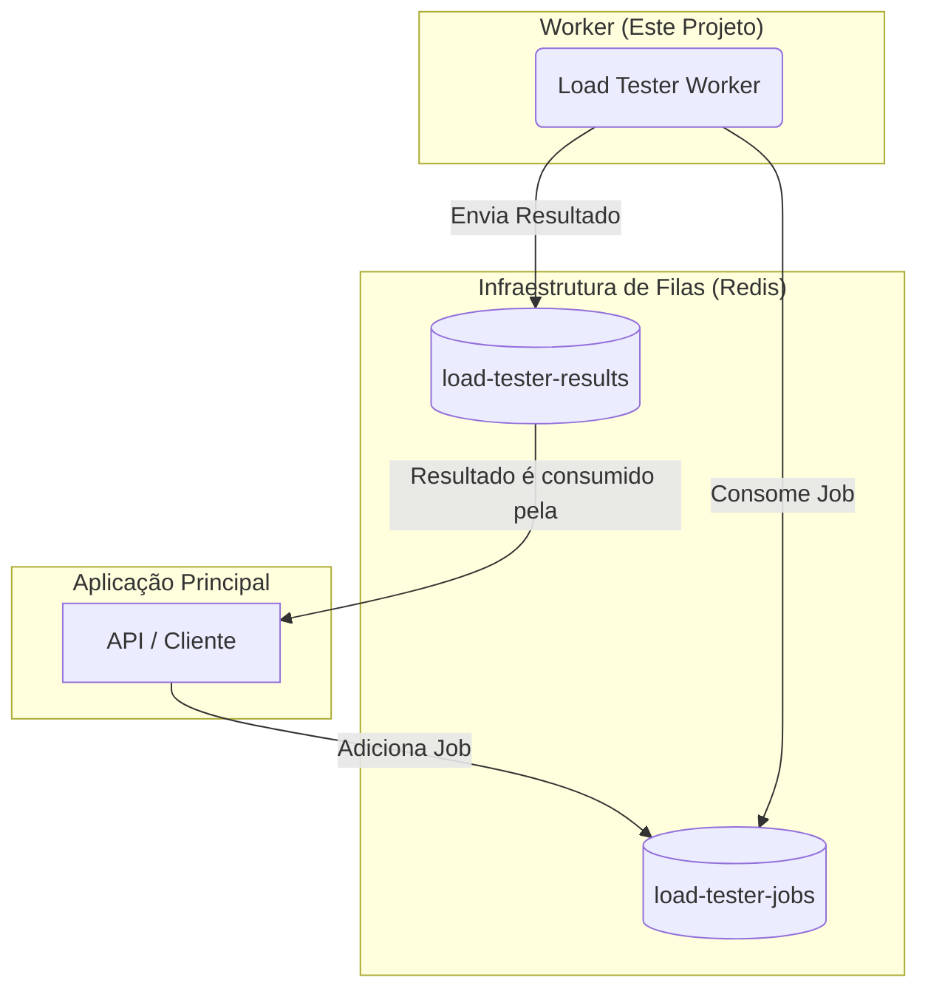

# Load Tester Worker

Este projeto é um serviço de "worker" (trabalhador) em Node.js, construído com TypeScript, responsável por processar e executar testes de carga de forma assíncrona. Ele utiliza a biblioteca [BullMQ](https://bullmq.io/) para gerenciar uma fila de trabalhos (jobs) baseada em Redis.

## Visão Geral

O worker foi projetado para ser robusto e escalável. Ele escuta uma fila de jobs, onde cada job contém os parâmetros para um teste de carga específico (URL alvo, número de requisições, concorrência, etc.). Ao receber um job, o worker executa o teste e, ao final, envia os resultados para uma outra fila, para que possam ser processados e armazenados por outro serviço.

## Arquitetura



A arquitetura é baseada em um sistema de filas para garantir o desacoplamento e a resiliência do sistema:

1.  **Fila de Jobs (`load-tester-jobs`):** A aplicação principal (API) adiciona jobs a esta fila. Cada job é uma solicitação para executar um teste de carga.
2.  **Worker (Este Projeto):** O worker consome os jobs da fila `load-tester-jobs`.
3.  **Fila de Resultados (`load-tester-results`):** Após a execução de um teste, o worker adiciona um novo job contendo os resultados completos a esta fila.
4.  **Consumo de Resultados:** A mesma aplicação principal (API) consome a fila de resultados para, por exemplo, salvar os dados em um banco de dados e notificar o usuário.

Este design permite que a execução dos testes (que pode ser demorada) não bloqueie o serviço principal e que o armazenamento dos resultados seja tratado de forma independente.

## Funcionalidades

- **Processamento Assíncrono:** Utiliza BullMQ para processar jobs em segundo plano.
- **Configuração Flexível de Testes:** Permite configurar URL, método HTTP, concorrência, payload, headers e timeout.
- **Tratamento de Erros Robusto:** Erros em jobs individuais são capturados sem derrubar o serviço.
- **Código Modular:** A lógica de negócio (`UseCase`) é separada da infraestrutura de filas (`Processor`).

## Pré-requisitos

- Node.js (versão 16 ou superior)
- NPM
- Um servidor Redis em execução
- Docker (para execução em container)

## Instalação

1. Clone o repositório e entre no diretório:
   ```bash
   git clone <url-do-seu-repositorio>
   cd load-tester-worker
   ```

2. Instale as dependências:
   ```bash
   npm install
   ```

## Configuração

Crie um arquivo de configuração de ambiente chamado `.env` na raiz do projeto com o seguinte conteúdo, ajustando os valores para o seu ambiente Redis.

```ini
# .env
REDIS_HOST=127.0.0.1
REDIS_PORT=6379

# Nomes das filas (opcional, pode usar o padrão)
QUEUE_LOAD_TESTS=load-tester-jobs
QUEUE_RESULTS=load-tester-results
```

## Uso

### Executando os Testes

Para rodar a suíte de testes unitários e de integração, execute:

```bash
npm test
```

### Modo de Desenvolvimento

Para executar o worker em modo de desenvolvimento com `ts-node` (que compila e executa os arquivos TypeScript em tempo real), você pode adicionar o seguinte script ao seu `package.json`:

```json
"scripts": {
  "dev": "ts-node src/index.ts",
  ...
}
```

E então executar:
```bash
npm run dev
```

### Build e Execução para Produção

1. **Compile o código TypeScript para JavaScript:**
   ```bash
   npm run build
   ```
   Este comando irá gerar os arquivos compilados no diretório `dist/`.

2. **Inicie o worker:**
   ```bash
   npm start
   ```
   Este comando executa o arquivo `dist/index.js` e é a forma recomendada para produção.

## Executando com Docker (Recomendado)

Para facilitar a implantação e garantir um ambiente consistente, o projeto está configurado para ser executado em um container Docker.

1. **Construa a imagem Docker:**
   Na raiz do projeto, execute:
   ```sh
   docker build -t load-tester-worker .
   ```

2. **Execute o container:**
   Para executar o worker, você precisa garantir que ele consiga se conectar à sua instância do Redis.

   **Exemplo (conectando a um Redis na mesma rede Docker ou localmente via `--network="host"`):**
   ```bash
   docker run --rm --name my-worker \
     -e REDIS_HOST=seu-host-redis \
     -e REDIS_PORT=sua-porta-redis \
     load-tester-worker
   ```
   > **Nota:** Para um ambiente de desenvolvimento ou produção mais robusto, é altamente recomendado o uso do `docker-compose` para orquestrar o serviço do worker e do Redis juntos.

## Estrutura do Código

- **`src/index.ts`**: Ponto de entrada da aplicação. Inicializa a conexão com o Redis, as dependências e o `Worker` do BullMQ.
- **`src/infrastructure/jobs/loadTest.processor.ts`**: Contém a classe `LoadTestProcessor`, que executa a lógica para cada job, chamando o `UseCase` e enviando o resultado para a fila de resultados.
- **`src/services/runLoadTest.usecase.ts`**: Contém a lógica de negócio principal, orquestrando as requisições HTTP concorrentes e calculando as estatísticas de performance.
- **`src/infrastructure/config/index.ts`**: Centraliza as configurações da aplicação, lendo-as do arquivo `.env`.
