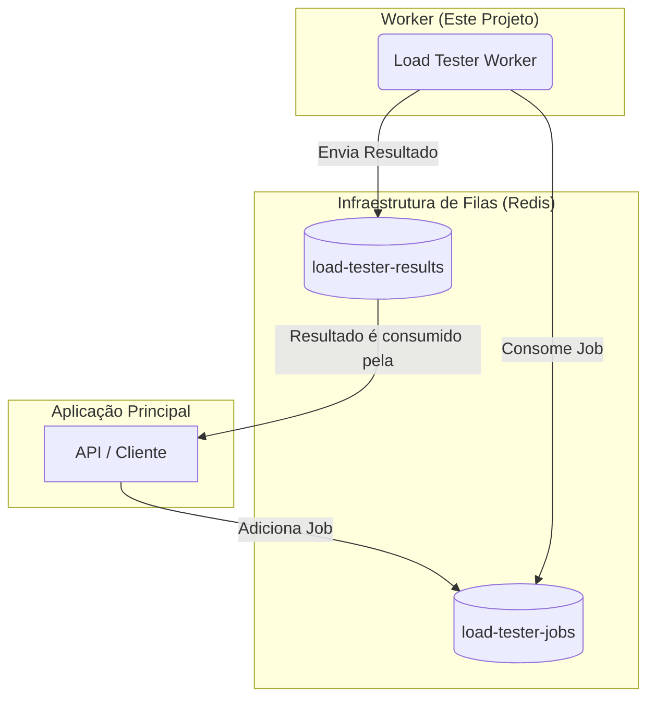

# Load Tester Worker

Este projeto é um serviço de "worker" (trabalhador) em Node.js, construído com TypeScript, responsável por processar e executar testes de carga de forma concorrente e assíncrona. Ele utiliza a biblioteca [BullMQ](https://bullmq.io/) para gerenciar uma fila de trabalhos (jobs) baseada em Redis.

## Visão Geral

O worker foi projetado para ser robusto e escalável. Ele escuta uma fila de jobs, onde cada job contém os parâmetros para um teste de carga específico (URL alvo, número de requisições, concorrência, etc.). Ao receber um job, o worker o despacha para uma thread separada para execução, permitindo o processamento paralelo de múltiplos testes. Ao final, os resultados são enviados para uma outra fila, para que possam ser processados e armazenados por outro serviço.

## Arquitetura



A arquitetura é baseada em um sistema de filas para garantir o desacoplamento e a resiliência do sistema. Internamente, o `Load Tester Worker` utiliza uma arquitetura baseada em `worker_threads` para alcançar alta concorrência. Quando um job é consumido da fila, o processador principal não executa o teste diretamente. Em vez disso, ele atua como um despachante, iniciando um `worker thread` dedicado para aquele job específico. Isso permite que o processo principal fique livre para consumir novos jobs, possibilitando a execução paralela de múltiplos testes de carga e aproveitando ao máximo os recursos da máquina.

## Funcionalidades

- **Processamento Assíncrono:** Utiliza BullMQ para processar jobs em segundo plano.
- **Execução Concorrente de Testes:** Graças ao uso de `worker_threads` do Node.js, o worker pode processar múltiplos testes de carga simultaneamente, cada um em sua própria thread, otimizando o uso de CPUs multi-core.
- **Configuração Flexível de Testes:** Permite configurar URL, método HTTP, concorrência, payload, headers e timeout.
- **Tratamento de Erros Robusto:** Erros em jobs individuais são capturados sem derrubar o serviço.
- **Código Modular:** A lógica de negócio (`UseCase`) é separada da infraestrutura de filas (`Processor`).
- **Job Locking (Bloqueio de Jobs):** Para evitar que um mesmo job seja processado por múltiplos workers simultaneamente ou reprocessado em caso de falha inesperada, cada job é bloqueado por um período configurável (`lockDuration`). Se o worker não concluir o processamento nesse tempo, o job é automaticamente liberado para uma nova tentativa.

## Pré-requisitos

- Node.js (versão 16 ou superior)
- NPM
- Um servidor Redis em execução
- Docker (para execução em container)

## Instalação

1. Clone o repositório e entre no diretório:
   ```bash
   git clone <https://github.com/luisfelix-93/load-tester-worker.git>
   cd load-tester-worker
   ```

2. Instale as dependências:
   ```bash
   npm install
   ```

## Configuração

Crie um arquivo de configuração de ambiente chamado `.env` na raiz do projeto com o seguinte conteúdo, ajustando os valores para o seu ambiente Redis.

```ini
# .env
REDIS_HOST=127.0.0.1
REDIS_PORT=6379

# Nomes das filas (opcional, pode usar o padrão)
QUEUE_LOAD_TESTS=load-tester-jobs
QUEUE_RESULTS=load-tester-results
```

## Uso

### Executando os Testes

Para rodar a suíte de testes unitários e de integração, execute:

```bash
npm test
```

### Modo de Desenvolvimento

Para executar o worker em modo de desenvolvimento com `ts-node` (que compila e executa os arquivos TypeScript em tempo real), você pode adicionar o seguinte script ao seu `package.json`:

```json
"scripts": {
  "dev": "ts-node src/index.ts",
  ...
}
```

E então executar:
```bash
npm run dev
```

### Build e Execução para Produção

1. **Compile o código TypeScript para JavaScript:**
   ```bash
   npm run build
   ```
   Este comando irá gerar os arquivos compilados no diretório `dist/`.

2. **Inicie o worker:**
   ```bash
   npm start
   ```
   Este comando executa o arquivo `dist/index.js` e é a forma recomendada para produção.

## Executando com Docker (Recomendado)

Para facilitar a implantação e garantir um ambiente consistente, o projeto está configurado para ser executado em um container Docker.

1. **Construa a imagem Docker:**
   Na raiz do projeto, execute:
   ```sh
   docker build -t load-tester-worker .
   ```

2. **Execute o container:**
   Para executar o worker, você precisa garantir que ele consiga se conectar à sua instância do Redis.

   **Exemplo (conectando a um Redis na mesma rede Docker ou localmente via `--network="host"`):**
   ```bash
   docker run --rm --name my-worker \
     -e REDIS_HOST=seu-host-redis \
     -e REDIS_PORT=sua-porta-redis \
     load-tester-worker
   ```
   > **Nota:** Para um ambiente de desenvolvimento ou produção mais robusto, é altamente recomendado o uso do `docker-compose` para orquestrar o serviço do worker e do Redis juntos.

## Estrutura do Código

- **`src/index.ts`**: Ponto de entrada da aplicação. Inicializa a conexão com o Redis, as dependências e o `Worker` do BullMQ. É aqui que são configurados os parâmetros do worker, como o `lockDuration`.
- **`src/infrastructure/jobs/loadTest.processor.ts`**: Contém a classe `LoadTestProcessor`. Ele atua como um despachante: ao receber um job, ele inicia um `worker thread` para executar o teste e aguarda o resultado.
- **`src/infrastructure/workers/loadTest.worker.ts`**: Ponto de entrada para o `worker thread`. Este script recebe os dados do job do processo principal, instancia e executa o `RunLoadTestUseCase`, e envia o resultado de volta.
- **`src/services/runLoadTest.usecase.ts`**: Contém a lógica de negócio principal, orquestrando as requisições HTTP concorrentes e calculando as estatísticas de performance. Esta classe agora é executada dentro de um `worker thread` isolado.
- **`src/infrastructure/config/index.ts`**: Centraliza as configurações da aplicação, lendo-as do arquivo `.env`.
